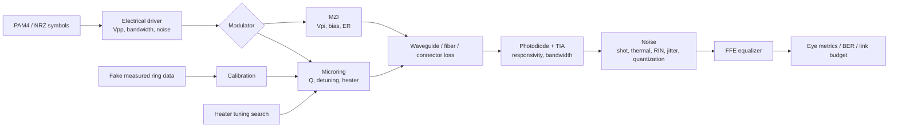

# Photon Link Lab

A Python/JAX-ready simulator for a silicon-photonic optical link, from PAM4/NRZ
symbols through modulator, channel, photodiode/TIA, equalization, eye metrics,
BER estimation, calibration, and heater tuning.

The project is organized as an engineering artifact: package code, CLI,
deterministic datasets, tests, plots, CI, notebooks, and a technical write-up.
Notebooks are walkthroughs only; the simulator lives in `src/photon_link_lab`.

## System Diagram



## Quickstart

```bash
pip install -e ".[dev]"
pytest
python -m photon_link_lab.cli simulate --out artifacts/demo
python -m photon_link_lab.cli benchmark
python -m photon_link_lab.cli dashboard --out artifacts/demo/dashboard.html
```

Installed entry point:

```bash
photon-link simulate --pam-order 4 --modulator ring --out artifacts/demo
photon-link generate-data --out data/measured/fake_measured_ring_sweep.csv
photon-link calibrate --data data/measured/fake_measured_ring_sweep.csv
photon-link sweep --out data/benchmarks/tx_power_sweep.csv
photon-link drift --out data/benchmarks/thermal_drift_sweep.csv
photon-link yield --out data/benchmarks/yield_monte_carlo.csv
photon-link wdm --out data/benchmarks/wdm_sweep.csv
photon-link tune --thermal-shift-nm 0.12
photon-link benchmark
```

## Core Equations

Static link budget:

```text
P_tx,W = 1e-3 * 10^(P_tx,dBm / 10)
L_total,dB = L_mod,dB + L_waveguide,dB + L_fiber,dB + L_connector,dB
P_rx,W = P_tx,W * 10^(-L_total,dB / 10)
I_pd = R_pd * P_rx,W
V_tia = G_tia * I_pd
```

Microring through-port notch model:

```text
linewidth_nm = lambda_res / Q
detuning = (lambda_laser - lambda_res) / linewidth_nm
depth = 1 - 10^(-ER_dB / 10)
T_ring = 10^(-IL_dB / 10) * [1 - depth / (1 + (2 detuning)^2)]
```

MZI transfer:

```text
phi(V) = pi * V / Vpi + phi_bias
ER_floor = 10^(-ER_dB / 10)
T_mzi = 10^(-IL_dB / 10) * [ER_floor + (1 - ER_floor) * 0.5 * (1 + cos(phi))]
```

Detector noise:

```text
sigma_shot = sqrt(2 q I_avg B)
sigma_RIN = I_avg * sqrt(RIN_linear * B)
sigma_total = sqrt(sigma_shot^2 + sigma_thermal^2 + sigma_RIN^2)
```

Empirical BER estimate:

```text
SER = symbol_errors / symbols
BER ~= SER / log2(PAM_order)
Q_eye = min_i (mu_{i+1} - mu_i) / (sigma_{i+1} + sigma_i)
```

## Current Results

The canonical command is:

```bash
python -m photon_link_lab.cli benchmark
```

It regenerates:

| Artifact | Path |
|---|---|
| Fake measured ring sweep | `data/measured/fake_measured_ring_sweep.csv` |
| TX power sweep | `data/benchmarks/tx_power_sweep.csv` |
| Thermal drift sweep | `data/benchmarks/thermal_drift_sweep.csv` |
| Monte Carlo yield | `data/benchmarks/yield_monte_carlo.csv` |
| WDM channel sweep | `data/benchmarks/wdm_sweep.csv` |
| Link metrics | `artifacts/demo/link_metrics.json` |
| Calibration result | `artifacts/demo/calibration.json` |
| Heater tuning result | `artifacts/demo/heater_tuning.json` |
| Dashboard | `artifacts/demo/dashboard.html` |

Current quick-demo metrics:

| Metric | Value |
|---|---:|
| PAM order | 4 |
| Symbol count | 512 |
| Empirical BER | 0.122 |
| Eye Q | 1.000 |
| RX optical power | -5.83 dBm |
| Photocurrent | 214 uA |
| Calibration RMSE | 0.083 dB |
| Fitted Q | 8461 |

Representative plots:


## Implemented Scope

Base optical interconnect:

- PAM2/NRZ and PAM4 symbols.
- Electrical driver bandwidth and driver voltage noise.
- Microring or MZI modulator.
- Waveguide, fiber, and connector loss.
- Photodiode/TIA bandwidth and detector noise.
- Shot noise, thermal noise, RIN, quantization, and jitter-like impairment.
- Feed-forward equalizer.
- Eye diagram, eye-Q metrics, empirical SER/BER, and link budget.
- Parameter sweeps, thermal drift sweeps, and Monte Carlo device variability.
- WDM channel wavelength spacing, crosstalk matrix, and first-order dispersion
  penalty reporting.
- Fake measured ring data and least-squares ring calibration.
- Coarse-to-fine heater tuning search for resonance locking.
- Compact JSON export for behavioral model parameters.

Physics ladder status:

| Level | Status |
|---|---|
| 1 static link budget | Implemented |
| 2 ring transfer, detuning, Q, FSR, linewidth | Implemented |
| 3 thermal drift, heater tuning, actuator limits | Implemented baseline |
| 4 shot, thermal, RIN, quantization, jitter | Implemented baseline |
| 5 WDM, crosstalk, dispersion | Baseline implemented |
| 6 process/wafer statistics | Monte Carlo baseline implemented; wafer hierarchy planned |
| 7 compact models | JSON export implemented; Verilog-A-style export planned |
| 8 real/published data calibration | Synthetic calibration implemented; real/published adapter planned |

ML ladder status:

| Level | Status |
|---|---|
| 1 regression fit of physical parameters | Implemented |
| 2 heater tuning / resonance locking | Coarse-to-fine implemented; true BO planned |
| 3 neural surrogate | Planned |
| 4 uncertainty quantification | Planned |
| 5 active learning | Planned |
| 6 differentiable JAX optimization | Planned for smooth kernels |
| 7 RL/MPC drift controller | Planned |
| 8 anomaly detection | Planned |

## Repository Layout

```text
src/photon_link_lab/        package code
tests/                      unit and integration tests
docs/                       technical write-up, equations, traceability, debate
data/measured/              generated fake measurement data
data/benchmarks/            deterministic benchmark CSV/JSON files
plots/                      generated figures
artifacts/demo/             generated JSON reports and dashboard
notebooks/                  thin walkthrough notebooks
scripts/                    reproducibility helpers
.github/workflows/ci.yml    CI
```

## Limitations

This is a behavioral simulator, not an electromagnetic, TCAD, SPICE, or
Verilog-A signoff tool. BER values from short random sequences are empirical
estimates; low-BER claims should use longer runs or eye-Q proxy analysis.
The fake measured data validates the calibration workflow, not real-silicon
accuracy. JAX support is currently scoped as an optional backend direction for
smooth differentiable kernels rather than a full stochastic JAX rewrite.
